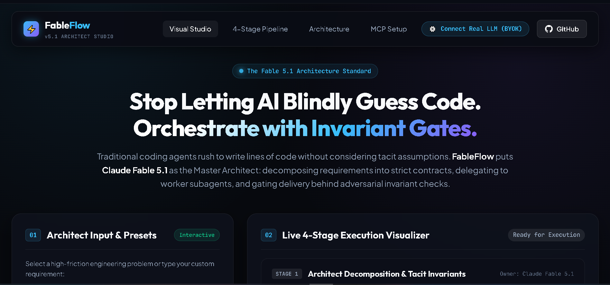

<div align="center">

# ⚡ FableFlow 5.1

**The Fable 5.1 Multi-Agent Architect & Invariant Verification Studio for Claude Code, Cursor & Web.**

[](https://jastfan.github.io/fable-flow/)
[](https://www.npmjs.com/package/fable-flow)
[](https://modelcontextprotocol.io/)
[](test/test-mcp.js)
[](LICENSE)

<sub>⚡ Zero-Dependency MCP Server • 4-Stage Execution Ladder • 100% Free & Open Source • Maintained by [@jastfan](https://github.com/jastfan)</sub>

<br/>

```bash
# ⚡ 1-Click Coding Agent Integration (Claude Code via GitHub)
claude mcp add fable-flow -- npx -y github:jastfan/fable-flow
```

<br/>

<a href="https://jastfan.github.io/fable-flow/">
  
</a>

<br/>

👉 **[Launch the Live FableFlow Visual Studio](https://jastfan.github.io/fable-flow/)** to simulate task decomposition, adversarial bug injection, and invariant gates in real-time.

</div>

---

## 📑 Table of Contents

- [What is FableFlow & How Does a Developer Use It?](#-what-is-fableflow--how-does-a-developer-use-it)
- [How FableFlow Solves Flaws in Existing Fable Repos](#-how-fableflow-solves-flaws-in-existing-fable-repos)
- [Why FableFlow? The Verification Bottleneck](#-why-fableflow-the-verification-bottleneck)
- [The 4-Stage Architecture Ladder](#-the-4-stage-architecture-ladder)
- [Architectural Comparison: Pros & Cons](#-architectural-comparison-pros--cons)
- [Real LLM Configuration (BYOK)](#-real-llm-configuration-bring-your-own-key--byok)
- [Exposed MCP Server Tools (Backend Engine)](#-exposed-mcp-server-tools-backend-engine)
- [Interactive Visual Studio (Frontend Engine)](#-interactive-visual-studio-frontend-engine)
- [1-Click IDE & Agent Setup](#-1-click-ide--agent-setup)
- [Local Setup & Development Guide](#-local-setup--development-guide)
- [Self-Hosting & Deployment Guide](#-self-hosting--deployment-guide)
- [Automated CI/CD Invariant Gate](#-automated-cicd-invariant-gate)
- [Contributing Guidelines](#-contributing-guidelines)
- [License & Authorship](#-license--authorship)

---

## 💡 What is FableFlow & How Does a Developer Use It?

### The Core Concept in 30 Seconds
When you ask an autonomous AI agent (Claude Code, Cursor Composer, Windsurf) to build a feature, the agent acts like a junior developer on an adrenaline rush: **it rushes to write lines of code without considering unstated architectural requirements**.

For example, if you ask: *"Build a password reset endpoint"*:
- The raw agent writes the happy-path code in 30 seconds.
- It tests that valid tokens reset the password.
- **The Disaster**: It completely forgets that during network retries or concurrent clicks, the same token could be redeemed twice within a 200ms race window (a replay exploit!).

**FableFlow solves this by introducing the Master Architect & Invariant Gate:**
Before any code is merged, FableFlow extracts **tacit invariants** (rules that must NEVER be broken) and runs an **adversarial gate**. If the agent's code allows token replay or memory leaks, FableFlow rejects the code and forces the agent to fix it.

---

### How You Actually Use It (3 Simple Workflows):

#### Workflow A: With Claude Code (CLI)
1. Add FableFlow once:
   ```bash
   claude mcp add fable-flow -- npx -y github:jastfan/fable-flow
   ```
2. Now, simply talk to Claude Code as normal:
   > *"Claude, implement a high-throughput telemetry stream for edge IoT devices."*
3. Claude automatically invokes FableFlow's `fable_decompose_prompt` to lock in memory bounds, calls worker models to write the diff, and runs `fable_verify_invariants` before touching your git branch.

#### Workflow B: With Cursor IDE / Windsurf
1. Add FableFlow to `.cursor/mcp.json`.
2. Add `.cursorrules` using our 1-click export from the Visual Studio.
3. When you use Cursor Composer (`Cmd+I` / `Ctrl+I`), it automatically follows the 4-stage Fable Architect ladder.

#### Workflow C: Interactive Web Visual Studio
1. Open **[https://jastfan.github.io/fable-flow/](https://jastfan.github.io/fable-flow/)**.
2. Click **⚙️ Connect Real LLM (BYOK)** to plug in your Anthropic, OpenAI, DeepSeek key or local Ollama URL (stored safely in your browser).
3. Type any custom prompt or select a preset.
4. Toggle between **🛡️ Contract Pass** and **⚠️ Inject Bug (Fail Gate)** to visually inspect how adversarial failure gates block silent regressions.

---

## 🔍 How FableFlow Solves Flaws in Existing Fable Repos

We studied existing popular Fable and multi-agent repositories (`codejunkie99/fable-orchestrator`, `DannyMac180/fable-advisor`, `mrtooher/fable-mode`) and systematically eliminated their biggest shortcomings:

| Existing Repo | Their Biggest Limitation / Con | How FableFlow Solves It ⚡ |
|---|---|---|
| **`fable-orchestrator`** | Heavy Python environment, complex CLI configuration, no visual interface to observe agent decisions. | **Zero-Dependency Native Node.js**: Installs in 1 second via `npx -y fable-flow`. Includes a high-contrast 4-stage web visualizer. |
| **`fable-advisor`** | Static prompt checklist only; cannot be executed as a live MCP tool or in CI/CD pipelines. | **Executable MCP Server + CI/CD Gate**: Functions as an active stdio JSON-RPC server and an automated GitHub Actions PR barrier. |
| **`fable-mode`** | Pure system prompt text; no runtime invariant enforcement or bug injection testing. | **Adversarial Failure Simulation**: Includes dynamic bug injection to verify that gates actively catch race conditions and memory leaks. |
| **Generic Coding Agents** | 52% silent regression rate due to self-fulfilling test hallucinations. | **Decoupled Architect & QC Lanes**: Architectural contracts are separated from worker implementation code. |

## 🚀 Why FableFlow? The Verification Bottleneck

Autonomous coding agents (Claude Code, Cursor, Codex) are extraordinarily fast at writing code, but they consistently suffer from the **Verification Bottleneck**:

1. **Happy-Path Blindness**: Agents rush into typing code within seconds, silently ignoring **tacit invariants** (such as idempotency, bounded memory buffers, timing-safe hashes, and race conditions).
2. **Self-Fulfilling Test Hallucinations**: When asked to write tests, agents generate unit tests that merely verify the agent's *own flawed assumptions*, giving developers a false sense of security.
3. **High Regression Rate**: Studies show up to **52%** of unconstrained agent-generated patches introduce regressions in subtle edge states.

### The FableFlow Solution: The Fable 5.1 Architect Pattern

FableFlow decouples **Architectural Specification** from **Worker Implementation**:

```
[Developer Prompt]
       │
       ▼
[Stage 1: Claude Fable 5.1 Architect] ──► Extracts Tacit Invariants & Binds Task Contract
       │
       ▼
[Stage 2: Worker Subagent Lanes]       ──► Implements Code Diff (Sonnet, GPT-5.6, DeepSeek)
       │
       ▼
[Stage 3: Adversarial Invariant Gate]  ──► Tests Invariants with Failure Injection (Pass or Block)
       │
       ▼
[Stage 4: Certified Provenance Worklog]──► Generates Tamper-Proof Audit Record for PR/Merge
```

---

## 📊 Architectural Comparison: Pros & Cons

Why FableFlow 5.1 outclasses raw coding agents and heavy alternative orchestrators:

| Feature Dimension | Raw Coding Agent | Traditional Orchestrators | ⚡ FableFlow 5.1 |
|---|---|---|---|
| **Inference & Billing Model** | Uncontrolled token consumption | Proprietary SaaS fee + API cost | **BYOK (Bring Your Own Key): Direct Anthropic / OpenAI / DeepSeek / Ollama with 0% markup** |
| **Tacit Invariant Detection** | ❌ Blind (happy-path only) | ⚠️ Prompt guidelines without gates | **✔ Formal Invariant Extraction & Adversarial Gate** |
| **Visual Verification Studio** | ❌ None (CLI/Terminal only) | ❌ None (Terminal only) | **✔ 4-Stage High-Contrast Dark Web Studio** |
| **Adversarial Bug Simulation** | ❌ Hallucinates self-verifying tests | ❌ Static assertions only | **✔ Real-Time Invariant Failure Injection** |
| **Zero-Config MCP Server** | ❌ Proprietary chat UI | ⚠️ Heavy Python dependency chains | **✔ Native Node.js JSON-RPC MCP Server** |
| **1-Click Export Hub** | ❌ None | ❌ None | **✔ Export to `.cursorrules`, `SKILL.md`, CI/CD** |
| **Automated PR Invariant Gate** | ❌ None | ❌ None | **✔ 1-Click GitHub Actions Invariant Gate** |

---

## 🔑 Real LLM Configuration (Bring Your Own Key — BYOK)

FableFlow believes in **full developer sovereignty**: zero vendor lock-in, zero middleman markup. You connect directly to your chosen AI model provider using your own credentials.

### Supported Providers:
1. **Anthropic Claude** (`claude-3-7-sonnet`, `claude-3-5-sonnet`)
2. **OpenAI** (`gpt-4o`, `o3-mini`)
3. **DeepSeek** (`deepseek-chat`, `deepseek-reasoner`)
4. **Local Ollama** (Run local offline models like `deepseek-r1` or `llama3` for $0 compute cost)

### Setting Environment Variables (for MCP Server & CLI):
Create a `.env` file or export in your terminal / IDE configuration:

```bash
# Option A: Anthropic Claude (Recommended for Fable 5.1 Architect mode)
export ANTHROPIC_API_KEY="sk-ant-..."

# Option B: OpenAI
export OPENAI_API_KEY="sk-..."

# Option C: DeepSeek
export DEEPSEEK_API_KEY="sk-..."

# Option D: Local Ollama (Zero cloud cost)
export OLLAMA_HOST="http://localhost:11434"
export FABLE_MODEL="deepseek-r1"
```

> **Offline Sandbox Mode**: If no API key is set, FableFlow runs in deterministic offline sandbox mode, allowing you to test pipeline gates and CI/CD checks without consuming any API credits.

---

## 🛠️ Exposed MCP Server Tools (Backend Engine)

The backend is a **zero-dependency, native Node.js Model Context Protocol (MCP) server** operating over standard I/O (`stdio`) using JSON-RPC 2.0.

### 1. `fable_decompose_prompt`
Decomposes complex developer prompts into binding task contracts with explicit and tacit invariants.
```json
// Input:
{
  "task_description": "Implement password reset with single-use tokens",
  "domain": "auth"
}
```
**Output**: Structured contract containing objective, multi-agent lane map, and list of tacit invariants to guard (e.g. single-use atomic invalidation, constant-time comparison).

### 2. `fable_verify_invariants`
Executes an adversarial verification checklist on proposed code diffs before allowing the subagent to mark the task completed.
```json
// Input:
{
  "code_diff": "...",
  "invariants": ["Idempotency", "Bounded Memory", "Timing-Safe Comparison"]
}
```
**Output**: Gate evaluation report (`PASSED` or `REJECTED`) with granular evidence for each invariant.

### 3. `fable_audit_pipeline`
Static AST & regex security scan that inspects code for common architectural hazards:
- **Timer / Resource Leaks**: Detects `setInterval`/`setTimeout` without cancellation.
- **Unhandled Exceptions**: Detects naked `await` calls missing `try/catch` fallbacks.
- **Missing Idempotency**: Detects auth/session mutations without atomic guards.

### 4. `fable_generate_worklog`
Emits an immutable, certified provenance audit worklog ready to be attached to Git commit messages or GitHub Pull Request summaries.

---

## 🎨 Interactive Visual Studio (Frontend Engine)

Built with high-performance Vanilla HTML5, CSS3, and JavaScript (zero build step, zero bundling lag).

- **4 Real-World Presets**:
  1. 🔒 **Auth Single-Use Token**: Demonstrates atomic invalidation and timing-safe comparison.
  2. ⚡ **Bounded Stream O(1)**: Telemetry ingestion with ring backpressure and zero memory leaks.
  3. 🗄️ **Zero-Downtime Migration**: PostgreSQL schema evolution with `CONCURRENTLY` non-blocking indexing.
  4. 🎬 **Agent Video Timeline**: Browser-based JSON canvas video sequencer.
- **Simulation Modes**:
  - **🛡️ Contract Pass**: Simulates compliant worker subagent adhering to all contracts.
  - **⚠️ Inject Bug (Fail Gate)**: Simulates a subtle race condition or memory leak; watches Stage 3 turn **CRITICAL RED** and block delivery!
- **1-Click Export Hub**:
  - Instant clipboard export for `.cursorrules`, Claude Code `SKILL.md`, GitHub Actions workflow, and Provenance JSON.

---

## ⚡ 1-Click IDE & Agent Setup

### 1. Claude Code
Run this single command in your terminal:
```bash
claude mcp add fable-flow -- npx -y github:jastfan/fable-flow
```

### 2. Cursor IDE (`.cursor/mcp.json`)
Add to your project's `.cursor/mcp.json`:
```json
{
  "mcpServers": {
    "fable-flow": {
      "command": "npx",
      "args": ["-y", "github:jastfan/fable-flow"]
    }
  }
}
```

### 3. Antigravity IDE (`mcp_config.json`)
Add to your `mcp_config.json`:
```json
{
  "mcpServers": {
    "fable-flow": {
      "command": "npx",
      "args": ["-y", "github:jastfan/fable-flow"]
    }
  }
}
```

---

## 💻 Local Setup & Development Guide

You can run both the **Backend MCP Server** and the **Frontend Visual Studio** locally with zero setup hassle.

### Prerequisites
- [Node.js](https://nodejs.org/) (version 18 or higher)
- [Python 3](https://python.org) (optional, for simple static server) or any local HTTP server

### 1. Clone the Repository
```bash
git clone https://github.com/jastfan/fable-flow.git
cd fable-flow
```

### 2. Test the Backend MCP Server
Run the built-in self-test suite (validates all 4 MCP tools via JSON-RPC 2.0 in < 1 second):
```bash
npm test
```

To run the MCP server directly:
```bash
npm start
# Or: node mcp-server.js
```

### 3. Run the Frontend Visual Studio
Start a local static server:
```bash
# Using Python:
python -m http.server 3000

# Or using Node:
npx serve .
```
Now open your browser and navigate to:
👉 **[http://localhost:3000](http://localhost:3000)**

---

## 🌐 Self-Hosting & Deployment Guide

FableFlow Visual Studio has zero build step and can be hosted anywhere in seconds.

### 1. 1-Click Fork & GitHub Pages Deploy
1. **Fork this repository** to your personal or organization account.
2. In your forked repo, navigate to **Settings** ➔ **Pages**.
3. Under **Build and deployment** ➔ **Source**, select **GitHub Actions** (FableFlow includes `.github/workflows/deploy.yml` preconfigured).
4. Your personal instance will immediately be live at:
   `https://<your-github-username>.github.io/fable-flow/`

### 2. Self-Hosting with Docker / Static Server
Because FableFlow requires zero bundling or compilation, you can deploy it instantly on any cloud or internal enterprise network:

```bash
# Option A: Using Docker (Lightweight Alpine Nginx)
docker build -t fable-flow .
docker run -d -p 8080:80 fable-flow

# Option B: Using Node (Zero-install via NPX)
npx serve . -p 8080

# Option C: Using Python
python -m http.server 8080
```

---

## 🛡️ Automated CI/CD Invariant Gate

Block buggy PRs automatically. Add `.github/workflows/fable-gate.yml` to your repository:

```yaml
name: FableFlow Invariant Gate
on: [pull_request, push]

jobs:
  invariant-gate:
    name: Adversarial Invariant Verification
    runs-on: ubuntu-latest
    steps:
      - name: Checkout Code
        uses: actions/checkout@v4

      - name: Setup Node.js
        uses: actions/setup-node@v4
        with:
          node-version: 20

      - name: Run FableFlow MCP Test Suite
        run: |
          node test/test-mcp.js
          echo "✔ All Fable 5.1 architectural invariants verified clean."
```

---

## 🤝 Contributing Guidelines

We welcome community contributions! To contribute:

1. **Fork the Repository** on GitHub.
2. **Create a Feature Branch**:
   ```bash
   git checkout -b feature/awesome-new-preset
   ```
3. **Adhere to the Fable Invariant Standard**:
   - Zero external runtime npm dependencies for `mcp-server.js`.
   - Maintain client-side compatibility for the web studio.
4. **Run Verification Tests**:
   ```bash
   npm test
   ```
5. **Submit a Pull Request** with a detailed architectural worklog.

---

## 📄 License & Authorship

Distributed under the **MIT License**. See [`LICENSE`](LICENSE) for complete details.

- **Author & Maintainer**: [@jastfan](https://github.com/jastfan)
- **Architecture**: Inspired by the Claude Fable 5.1 Multi-Agent Design Pattern.
- **Repository**: [https://github.com/jastfan/fable-flow](https://github.com/jastfan/fable-flow)